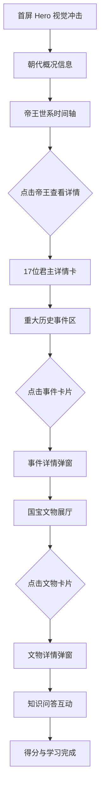

# 夏朝历史知识学习页面 - 产品需求文档（PRD）

## 1. 产品概述

一个以夏朝为主题的交互式历史知识学习页面，通过精致的视觉设计与丰富的交互动效，让用户沉浸式地探索中国第一个世袭制王朝的历史人物、关键事件与出土文物。

* **目标用户**：历史爱好者、学生、对中华文明起源感兴趣的大众

* **核心价值**：把零散的夏朝史料（14代17王世系、7大关键事件、二里头国宝文物）整合为可交互、可探索的视觉化学习体验，让"枯燥的远古史"变得鲜活可感

* **设计目标**：以"青铜与玉"的东方古典美学为基底，融合现代交互设计，做出一个让人"Wow"的炫酷学习页面

## 2. 核心功能

### 2.1 功能模块

1. **首屏 Hero 区**：夏朝主题视觉冲击 + 朝代基本信息（约公元前2070年—前1600年，共14代17王，约470年）
2. **帝王世系时间轴**：可滚动的17位君主时间轴，点击查看每位帝王详情
3. **重大历史事件**：7个关键事件的交互式卡片（大禹治水、涂山之会、启建夏朝·甘之战、太康失国、少康中兴、孔甲乱政、鸣条之战）
4. **国宝文物展厅**：二里头出土文物展示（绿松石龙形器、嵌绿松石兽面纹铜牌饰、青铜爵等）
5. **知识问答**：交互式小测验，检验学习成果

### 2.2 页面详情

| 页面区域    | 模块名称    | 功能描述                            |
| ------- | ------- | ------------------------------- |
| 首屏 Hero | 朝代标题与信息 | 大字"夏"字背景，朝代起止年份、王代数、疆域信息，滚动引导动画 |
| 首屏 Hero | 粒子/水墨动效 | 青铜纹样粒子或水墨晕染动效，营造远古氛围            |
| 帝王世系    | 时间轴导航   | 17位君主横向/纵向时间轴，hover 高亮，点击展开详情卡  |
| 帝王世系    | 帝王详情卡   | 显示在位年份、事迹、历史评价，含"失国/中兴"等标记      |
| 历史事件    | 事件卡片网格  | 7张事件卡，含标题、时间、简介、影响，点击展开详情       |
| 历史事件    | 事件详情弹窗  | 大图 + 详细经过 + 历史影响 + 相关人物         |
| 文物展厅    | 文物轮播/网格 | 文物卡片，含名称、年代、出土地、简介              |
| 文物展厅    | 文物详情弹窗  | 高清图 + 详细描述 + 历史意义               |
| 知识问答    | 问答交互    | 5道选择题，即时反馈正误，最终得分               |

## 3. 核心流程

用户进入页面 → 首屏视觉冲击 → 滚动浏览朝代概况 → 进入帝王世系时间轴了解17位君主传承 → 点击关键事件卡片深入理解历史转折点 → 进入文物展厅欣赏二里头国宝 → 参与知识问答检验学习 → 完成学习之旅

## 4. 用户界面设计

### 4.1 设计风格

**美学方向：东方古典青铜美学 × 现代暗黑奢华**

* **主色调**：深墨黑底（#0a0807）+ 青铜古绿（#3a6b5c / #6ba883）+ 金箔点缀（#c9a961 / #e8c97a）

* **辅助色**：朱砂红（#a83232）用于"暴政/亡国"标记，玉白（#e8e4d8）用于正文

* **字体**：标题用衬线/篆隶风格字体（思源宋体 / Noto Serif SC），正文用思源黑体

* **布局**：全屏分区滚动，卡片式内容，大量留白与精致细节

* **装饰元素**：青铜饕餮纹边框、回纹分隔线、篆刻印章式标签

* **动效**：滚动渐显、粒子飘浮、水墨晕染、卡片3D翻转

### 4.2 页面设计概览

| 页面区域    | 模块名称 | UI 元素                           |
| ------- | ---- | ------------------------------- |
| 首屏 Hero | 标题区  | 巨大"夏"字背景水印，金箔渐变标题，朝代年份副标题，滚动指引  |
| 首屏 Hero | 动效背景 | 青铜绿粒子飘浮 + 水墨晕染底纹                |
| 帝王世系    | 时间轴  | 纵向时间轴，青铜色节点，hover 金光，"失国"节点红色标记 |
| 历史事件    | 事件卡  | 网格布局，卡片hover上浮+金边发光，事件图标        |
| 文物展厅    | 文物卡  | 暗底+文物图，hover放大，金边相框效果           |
| 知识问答    | 问答区  | 选项hover高亮，正确绿色/错误红色，进度条         |

### 4.3 响应式

* 桌面优先（1920px / 1440px / 1280px）

* 平板自适应（768px-1024px）：时间轴改为横向滚动，网格改为单列

* 移动端适配（<768px）：所有模块单列堆叠，触摸优化

## 5. 内容数据

### 5.1 帝王世系（14代17王，约公元前2070-前1600年）

1. **禹**（开国，治水立功，涂山会盟）
2. **启**（家天下开创者，甘之战伐有扈氏）
3. **太康**（失国，沉迷游猎）
4. **仲康**（傀儡君主，受制后羿）
5. **相**（被寒浞追杀，夏中断40年）
6. **少康**（复国中兴，史称少康中兴）
7. **杼**（发明甲矛，征伐东夷，夏朝鼎盛）
8. **槐**（九夷来朝）
9. **芒**（始行沉祭河神）
10. **泄**（册封九夷爵位）
11. **不降**（在位59年最长，主动禅让弟扃）
12. **扃**（平稳传承）
13. **廑**（夏势初衰）
14. **孔甲**（好鬼神乱政，诸侯离心）
15. **皋**（短位无力回天）
16. **发**（招贤短暂振作）
17. **桀**（末代暴君，鸣条之战亡国）

### 5.2 七大关键事件

1. **大禹治水**（约前2070年前）：疏导法，十三年治水，划定九州
2. **涂山之会**：禹大会诸侯，万国来朝，确立共主地位
3. **启建夏朝·甘之战**：启废禅让立世袭，伐有扈氏作《甘誓》
4. **太康失国**：太康游猎，后羿夺斟鄩，夏中断数十年
5. **少康中兴**：少康诛寒浞复国，夏朝由乱转治转折点
6. **孔甲乱政**：好鬼神、沉酒色，诸侯背叛，夏势衰退
7. **鸣条之战**（约前1600年）：商汤伐桀，夏亡商立

### 5.3 国宝文物

1. **绿松石龙形器**（"华夏第一龙"）：2002年二里头出土，64.5cm，2000余片绿松石，距今约3800年
2. **嵌绿松石兽面纹铜牌饰**：青铜+绿松石镶嵌，约公元前1700-前1500年，中国青铜镶嵌工艺先驱
3. **青铜爵**：二里头文化典型酒器，中国早期青铜礼器代表
4. **七孔玉刀**：二里头出土大型玉礼器
5. **陶盉**：二里头文化典型陶器

