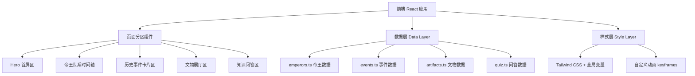

# 夏朝历史学习页面 - 技术架构文档

## 1. 架构设计

单页应用（SPA），纯前端实现，无后端服务。所有历史数据以本地 JSON/TS 模块形式内嵌，保证离线可用与零部署成本。



## 2. 技术选型

- **前端框架**：React 18 + TypeScript
- **构建工具**：Vite（vite-init 初始化）
- **样式方案**：Tailwind CSS 3 + CSS 变量（青铜色系）+ 自定义 keyframes 动画
- **动效库**：纯 CSS 动画为主，滚动渐显用 IntersectionObserver
- **图标**：内联 SVG（青铜纹样、印章、卷轴等装饰元素）
- **字体**：Google Fonts - Noto Serif SC（标题）+ Noto Sans SC（正文）
- **无后端、无数据库、无外部服务**

## 3. 路由定义

单页面滚动分区设计，不使用 React Router，通过锚点导航各区。

| 锚点 | 区域 | 说明 |
|------|------|------|
| #hero | 首屏 | 朝代标题与基本信息 |
| #emperors | 帝王世系 | 17位君主时间轴 |
| #events | 历史事件 | 7大关键事件 |
| #artifacts | 文物展厅 | 二里头国宝 |
| #quiz | 知识问答 | 互动测验 |

## 4. 组件结构

```
src/
├── App.tsx                      # 主应用，组织所有分区
├── main.tsx                     # 入口
├── index.css                    # 全局样式 + Tailwind + 字体 + CSS变量
├── data/
│   ├── emperors.ts              # 17位帝王数据
│   ├── events.ts                # 7大事件数据
│   ├── artifacts.ts             # 文物数据
│   └── quiz.ts                  # 问答数据
├── components/
│   ├── Hero.tsx                 # 首屏区
│   ├── EmperorTimeline.tsx      # 帝王时间轴
│   ├── EmperorCard.tsx          # 帝王详情卡
│   ├── EventSection.tsx         # 事件区容器
│   ├── EventCard.tsx            # 事件卡片
│   ├── EventModal.tsx           # 事件详情弹窗
│   ├── ArtifactSection.tsx      # 文物区容器
│   ├── ArtifactCard.tsx         # 文物卡片
│   ├── ArtifactModal.tsx        # 文物详情弹窗
│   ├── QuizSection.tsx          # 问答区
│   └── NavBar.tsx               # 顶部导航
└── hooks/
    ├── useScrollReveal.ts       # 滚动渐显 hook
    └── useLockBodyScroll.ts     # 弹窗时锁定滚动
```

## 5. 数据模型

### 5.1 帝王数据模型

```typescript
interface Emperor {
  id: number;
  name: string;          // "禹"
  alias?: string;        // "夏禹、大禹"
  reign: string;         // "约前2070-前2061"
  yearsOnThrone: number; // 在位年数
  generation: number;    // 第几代
  tag: 'founder' | 'normal' | 'lost' | 'restore' | 'tyrant';
  achievements: string;  // 主要事迹
  evaluation: string;    // 历史评价
}
```

### 5.2 事件数据模型

```typescript
interface HistoricalEvent {
  id: number;
  title: string;         // "大禹治水"
  time: string;          // "约公元前2070年前"
  icon: string;          // SVG/emoji 标识
  summary: string;       // 简介
  details: string;       // 详细经过
  impact: string;        // 历史影响
  figures: string[];     // 相关人物
}
```

### 5.3 文物数据模型

```typescript
interface Artifact {
  id: number;
  name: string;          // "绿松石龙形器"
  era: string;           // "二里头文化 距今约3800年"
  unearthed: string;     // "2002年二里头遗址"
  material: string;      // "绿松石"
  summary: string;       // 简介
  description: string;   // 详细描述
  significance: string;  // 历史意义
  imageUrl: string;      // 图片URL
}
```

## 6. 设计令牌（CSS 变量）

```css
:root {
  /* 背景色系 */
  --color-bg-deep: #0a0807;        /* 深墨黑 */
  --color-bg-dark: #14100d;        /* 暗褐 */
  --color-bg-card: #1c1714;        /* 卡片底 */

  /* 青铜色系 */
  --color-bronze: #3a6b5c;         /* 青铜绿 */
  --color-bronze-light: #6ba883;   /* 亮青铜 */
  --color-bronze-dark: #1f3d34;    /* 暗青铜 */

  /* 金箔色系 */
  --color-gold: #c9a961;           /* 金箔 */
  --color-gold-light: #e8c97a;     /* 亮金 */
  --color-gold-dark: #8a7340;      /* 暗金 */

  /* 强调色 */
  --color-cinnabar: #a83232;       /* 朱砂红（暴政/亡国）*/
  --color-jade: #e8e4d8;           /* 玉白（正文）*/

  /* 字体 */
  --font-serif: 'Noto Serif SC', serif;
  --font-sans: 'Noto Sans SC', sans-serif;
}
```

## 7. 关键交互与动效

1. **首屏粒子动效**：CSS 实现青铜绿粒子飘浮 + 水墨晕染背景
2. **滚动渐显**：IntersectionObserver 触发各区块淡入上移
3. **时间轴交互**：hover 节点金光扩散，点击展开详情卡 3D 翻转
4. **卡片悬浮**：事件/文物卡 hover 上浮 + 金边发光 + 阴影加深
5. **弹窗动画**：背景模糊 + 内容缩放淡入
6. **问答反馈**：选项点击即时颜色反馈 + 进度条动画

## 8. 性能与兼容

- 纯静态构建，首屏加载 < 2s
- 图片使用 web-optimized 占位（文物图用在线图片服务）
- 动画优先 CSS 实现，避免 JS 性能开销
- 兼容 Chrome/Edge/Firefox/Safari 最新版
